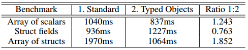

%ES7 Typed Objects
%CSCI 3155
%**J**esus Ortiz, (**S**carlett) Alicia Frisone, **B**rooke Robinson, **S**laton Spangler


Introduction of Typed Objects
====
* A feature of ECMAScript 7 
* Allows the use of defined types in objects
* Proposed to better the memory storage of objects
* More predictable performance

***
Overview of Presentation
====
* What is ECMAScript?
* Motivation
* History
* Typed Arrays and Typed Objects
* Supported Types
* Performance
* Pros
* Cons
* Examples
* Conclusion/References

***
What is ECMAScript?
====
* ECMAScript, simply put, is just the language specification of javascript
* It has gone through 6 revisions so far, the latest release being ECMAScript 2015, or ES6, released June of 2015.
* There is not a full implementation of all of ES6’s features, though many applications such as Firefox and Chrome make use of features from it. 

***
Motivation
====
* A data type in JavaScript which will behave like a statically typed language
* Avoid the pitfalls of Typed Arrays in ES6
* A smarter way to allocate memory

***
History
====
* JavaScript is a dynamically typed language
* Assigning different types to the same variable allowed
* ES6 introduced typed arrays, but they have their limitations


***
Typed Arrays and Typed Objects
====
* Typed Objects are generalizations of Typed Arrays
* Typed Arrays cannot use non scalar types
    - References to objects
    - Structs
* Typed objects overcome these limitations


***
What types are supported?
====
--- | --- | ---
any | uint8 | int8
float32 | object | uint16
int16 | float64 | string
uint32 | int32 | 

***
Difference between traditional objects
====
* JavaScript can allocate any data type to any variable
    - Always allocates 64-bits in memory, regardless of the number
* Typed Objects require that objects are the correct type
    - Behaves like a statically typed language
    - Optimally allocates memory based on type
    - ex: int32 allocates 32 bits

***
Memory Difference
====
-- | -- | -- | -- | -- | -- | -- | -- |
00 | 00 | 00 | 00 | 00 | 00 | 00 | 01 |
01 |    |    |    |    |    |    |    |


***
Syntax Difference: Traditional Objects vs. Typed Objects
====
ES5:
````javascript
function Car(color){
	this.color = color;
}
var myCar = new Car("blue");
````
ES7:
````javascript
var Car = new StructType({color:string})
var myCar = new Car();
myCar.color = "blue"
````

***
Runtime Comparison
====
* Not a ton of testing has been done, but there are some benchmarks that have been performed, but a few benchmarks show that, in general, typed objects are faster than vanilla javascript implementations.

* Above: The Benchmarks, and their runtimes. Only the second benchmark is slower for Typed Objects, meaning more work needs to be done (hence why ES7 is still a work in progress.)

***
Explanation of Benchmarks
====
* The “array of scalars” benchmark consists of a loop reading and writing bytes from and to an array. There are fewer cache misses when using Typed Objects, so the ES7 implementation is faster.
* The “struct fields” benchmark creates a struct with two fixed-length arrays as fields and repeatedly reads and writes those fields. The current JS implementation works better here.
* The “array of structs” benchmark creates a 1024x768 image of Color structs. This test, run with Typed Objects, runs faster than the regular JS implementation, also due to fewer cache misses.
* **TL;DR: Typed Objects make cache misses less common**


***
Pros
====
* Can be used to store references to objects
* Can attach methods to the type defined structs
* Can limit the type of data in each field to prevent hard to find bugs
* Using structures allows the programmer to completely customize the type to meet the specifications of their application


***
Cons
====
* No boolean types
    - No boolean types (unchecked)
    - Possibly covered in the “any” case
* Has not been released yet
    - ES6 still hasn’t been supported in most browsers, so support may take a while for ES7
    - Introduced two years ago

***
Example struct declaration
===

Create a struct that will be our new type
In this case, we are defining a “Point” type with two 8-bit integers
````
var Point = new StructType ({x:int8 , y:int8 });
var point = new Point();
point.x = 22;
point.y = 257;
````

***
Application Example
====
````
const Point2D = new StructType({ x: uint32, y: uint32 });
const Color = new StructType({ r: uint8, g: uint8, b: uint8 });
const Pixel = new StructType({ point: Point2D, color: Color });
 
const Triangle = Pixel.Array(3);
 
let t = Triangle([{ point: { x:  0, y: 0 }, color: { r: 255, g: 255, b: 255 } },
                  { point: { x:  5, y: 5 }, color: { r: 128, g: 0,   b: 0   } },
                  { point: { x: 10, y: 0 }, color: { r: 0,   g: 0,   b: 128 } }]);
````
***
Application Example (continued)
====
````
const Point2D = new StructType({ x: uint32, y: uint32 });
const Color = new StructType({ r: uint8, g: uint8, b: uint8 });
const Pixel = new StructType({ point: Point2D, color: Color });
 
const Triangle = Pixel.Array(3);
 
let t = Triangle([{ point: { x:  0, y: 0 }, color: { r: 255, g: 255, b: 255 } },
                  { point: { x:  5, y: 5 }, color: { r: 128, g: 0,   b: 0   } },
                  { point: { x: 10, y: 0 }, color: { r: 0,   g: 0,   b: “128” } }]);

* “128” is a string, this would cause an error since, b is declared as a unsigned 8 bit integer

````

***
Conclusion
====
* Typed Objects are not yet supported
* But when and if they are…
    - They will provide **faster**, more **memory-efficient** object type declarations 
* Typed Objects add functionality to dynamic scoping

***
Resources
====
* https://developer.mozilla.org/en-US/docs/Web/JavaScript/Data_structures
* http://smallcultfollowing.com/babysteps/pubs/2014.04.01-TypedObjects.pdf
* https://developer.mozilla.org/en-US/docs/Web/JavaScript/New_in_JavaScript/ECMAScript_Next_support_in_Mozilla

